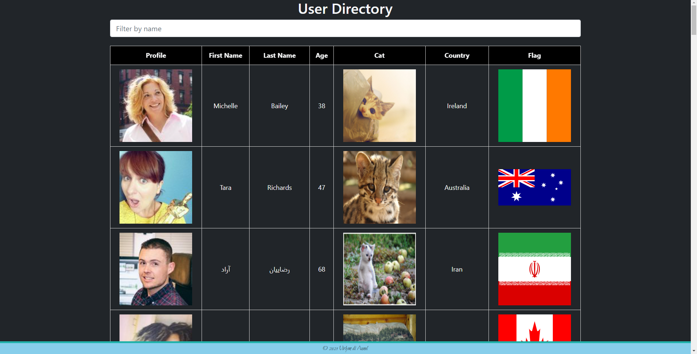

# **club-wealth-react-assessment**
  
  
  
  ## **Description**
  
  Utilizing React.js, and a starting template, create a webpage with the following requirements:

    1. Build a single webpage using at least 1 of the provided APIs beside user.js as a data source.
    2. Add to state
    3. Remove from state
    4. Use props (you’ll need to add your own component file to the project)
    5. Create a search field that filters what is shown to the client
    6. Styling is up to you. Doesn’t have to be beautiful, but if you have a good css idea you’re welcome to go for it!
    

  Bonus:

    1. Use 2 or more of the API files
    2. Add an additional API file.
    3. Feel free to add your own features and functionality (having a search bar is just the minimum requirement).
  <br><br>
  
  ## **Table of Contents**
  
  * [Installation](#Installation)
  * [Preview](#Usage)
  * [License](#License)
  * [Contributing](#Contributing)
  * [Technology](#Technology)
  * [Questions](#Questions)
  
  <br><br>
  
  ## **Installation**
  
  1. Clone the repo
  ```sh
  git clone https://github.com/virlym/club-wealth-react-assessment.git
  ``` 
  2. Install NPM packages
  ```sh
  npm install
  ```
  <br><br>
  
  ## **Preview**

  
  <br><br>
  
  ## **License**
  
  Distributed under the MIT License.
  <br><br>
  
  ## **Contributing**
  Contributions are what make the open source community such an amazing place to be learn, inspire, and create. Any contributions you make are **greatly appreciated**.
  
  1. Fork the Project
  2. Create your Feature Branch (`git checkout -b feature/AmazingFeature`)
  3. Commit your Changes (`git commit -m 'Add some AmazingFeature'`)
  4. Push to the Branch (`git push origin feature/AmazingFeature`)
  5. Open a Pull Request
  
  <br><br>
  
  ## **Technology**
  - [JavaScript](https://www.javascript.com/)
  - [React.js](https://reactjs.org/)
  - [Jquery](https://jquery.com/)
  - [npm Axios](https://www.npmjs.com/package/axios)
  <br><br>
  
  ## **Questions**
  Learn about more of my work at [my GitHub](https://github.com/virlym)
  
  You can send any additional questions to my email : virlym@gmail.com
  <br><br><br><br>